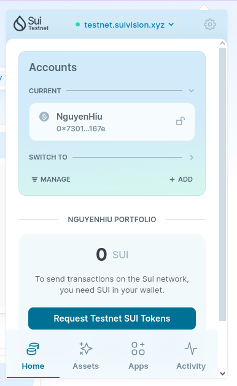
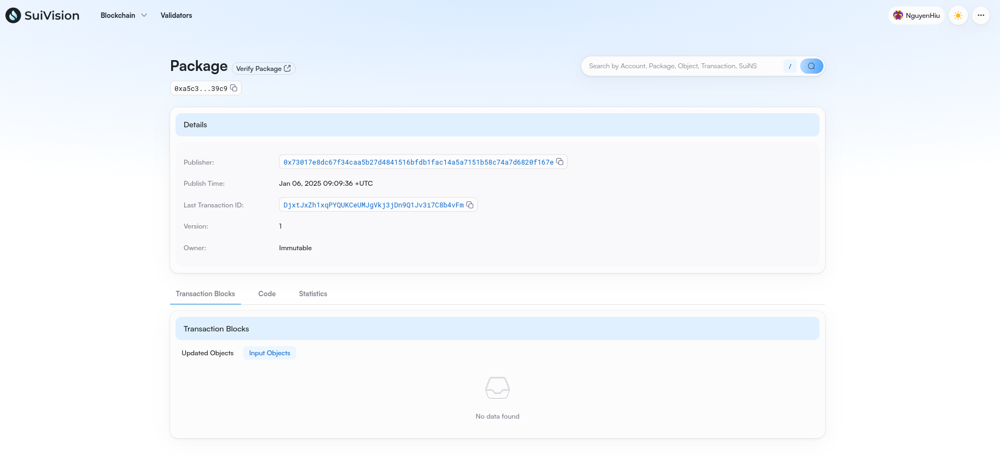
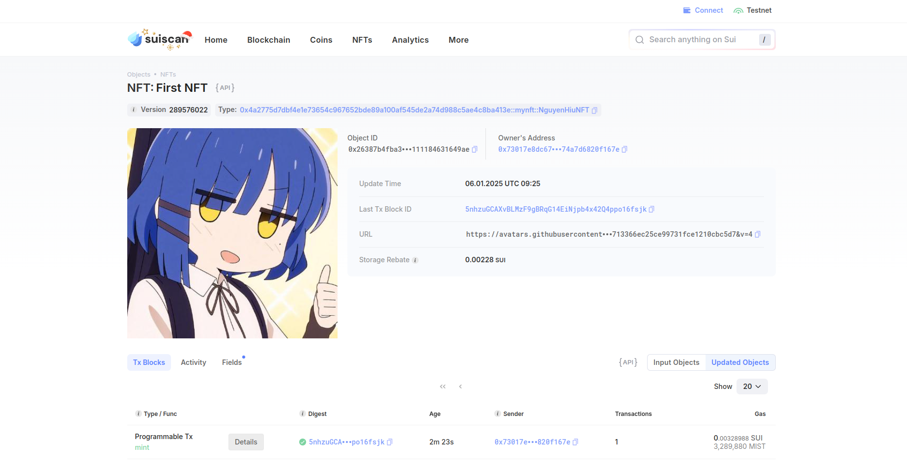

## Basic Information
- Sui Wallet Address: `0x73017e8dc67f34caa5b27d4841516bfdb1fac14a5a7151b58c74a7d6820f167e`
- Github: `NguyenHiu`

## Personal Introduction
- Work Experience: `1 year`
- Tech Stack: `Rust` `C++` `Golang` `Python` `Solidity` `Move on Aptos`
- I have experience in web2, particularly as a back-end developer. With me, software development is something so interesting, besides, I have worked on the Solidity language, Move on Aptos. As an enthusiastic developer, I fell in love with Software Dev, Game Dev, Blockchain Dev, Cryptography,... Learning all these cool things is my passion, and Move on Sui is one of the first steps I need.
- Contact: telegram `@ngyeenxhiu`

## Tasks

### 01 hello move
- [x] Sui CLI Version: sui 1.39.3-5d4350d66d2b
- [x] Sui Wallet Screenshot: .
- [x] Package ID: 0xa5c38d248f6c526c5ed13acf550b9cca74244c76f52864fce8e114e9e02139c9
- [x] Package ID's Screenshot from Explorer: 

### 02 move coin
- [x] `My Coin` Package ID: 0x3f136372e3c1230e4bc53fc3fb4c7c4878f3580497536c224714a2282dbc0b64
- [x] `Faucet Coin` Package ID: 0x1dc5064eb027024bff77b1ba5bcce6e9e9bcb8df2c58e609e4c4e35025ac912f
- [x] Transfer `My Coin` hash: AYEpgSwnYdejmnjUxcVRQQBLvk1FttRMA8oaCw6aJros
- [x] `Faucet Coin` address 1 mint hash: 7o693b2EwixaxcFDy5Sqrm6cyL4Gj1j5C7FtZaCvjFzF
- [x] `Faucet Coin` address 2 mint hash: 8sET7M18S1h9vVbA1xUjw3XRh2WkBvWLZHESx7hep8M1

### 03 move nft
- [x] NFT Package ID: 0x4a2775d7dbf4e1e73654c967652bde89a100af545de2a74d988c5ae4c8ba413e
- [x] NFT Object ID: 0x26387b4fba35eaea332b4733a50718777484dbfb2026925700111184631649ae
- [x] Transfer NFT hash: DRoBbCcY1fZxLivmmcMjC8YvrgYF9XvgKuGSU9SBwGXN
- [x] NFT's Screenshot from Explorer: 

### 04 move game
- [x] Game Package ID: 0xf9fbea073f644e578bcb239b8398c6b93524815543e01443dce39fdc1c820283
- [x] Deposit Coin Hash: E8KzSbocuE9e9o1vEB77whqk6z5ZQp9mz3WS7DRLg1QK
- [x] Withdraw Coin Hash: E764TdBq5bYUWJaU7jUCBaitQpfUtoSHEFSFRmgHYeEj
- [x] Play Game Hash: o6eEDnQtNpjS8iUP8Y7cw3cBAn5T4Zkt2eGhLgdciim

### 05 move swap
- [x] Swap Package ID: 0x8834925a29a2ae5032adfb7381302fb9ca6ce50e5612e54d657f18ba4aaee5ea
- [x] Call Swap Coin A -> Coin B hash: J776Wk2MLvk9LE1f6Kjm56qptQCcLWY4EVxqEBGB94vJ
- [x] Call Swap Coin B -> Coin A hash: EbY7eNMF8EFXrKQJ81GscCxVYjZKQVyM8EL4xojq9JP

### 06 dapp-kit SDK PTB
- [x] Save Hash: DpVfZoATKPNcYfcsonf2eqfCcU1J6kWrF26Qz4fpx8VU
