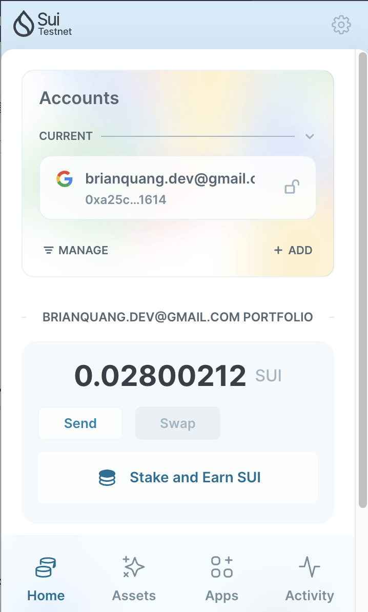
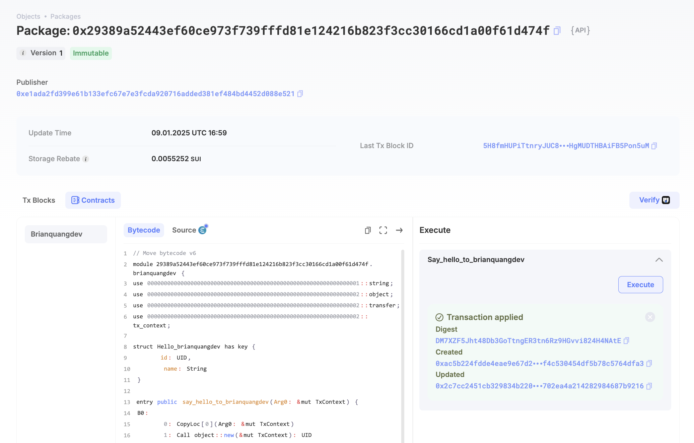
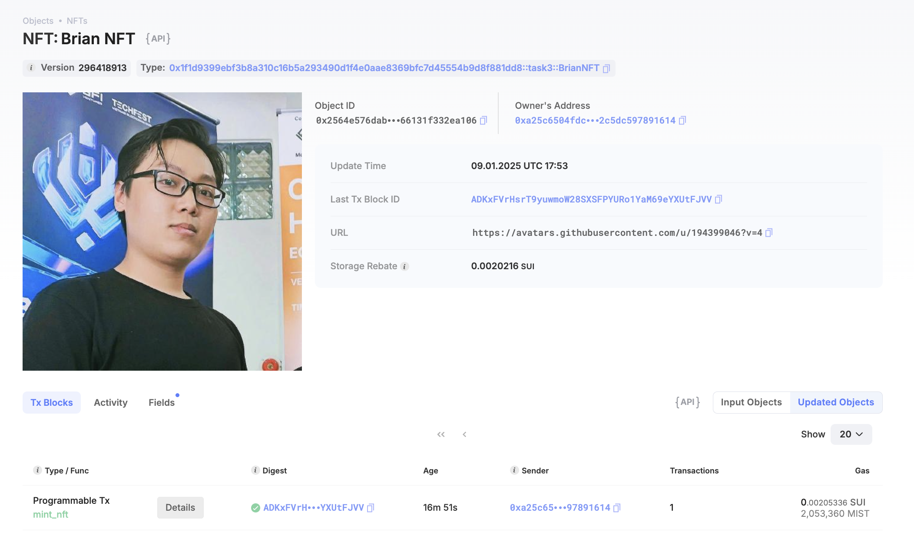

## Basic Information
- Sui Wallet Address: `0xa25c6504fdcfb4c7d170a4932e3afe211ba36b6829d98dcf702c5dc597891614`
- Github: `brianquangdev`

## Personal Introduction
- Work Experience: `0 years`
- Tech Stack: `Rust` `C#` `Python` `React` `Typescript` `NodeJS`
> 'I am currently a final-year student at Huflit, majoring in Data Science. My strengths lie in Machine Learning and AI. At the moment, I am deeply interested in blockchain, particularly in the Web3 space. I have participated in hackathons organized by VBI and achieved notable accomplishments. Recently, I have been especially intrigued by Move and projects within the SUI ecosystem, as I see SUI as a promising platform for combining blockchain with AI to create groundbreaking educational solutions. SUI stands out with its high performance, low transaction fees, and strong security, making it an ideal foundation for deploying decentralized applications. I believe the integration of SUI’s blockchain technology with AI can drive significant advancements in education, such as building intelligent learning systems, personalizing learning paths, and enhancing transparency in managing and storing educational data. This is an exciting direction that I am eager to explore further.'
- Discord: `Brian Quang`

## Tasks

### 01 hello move
- [x] Sui CLI Version: sui 1.39.3
- [x] Sui Wallet Screenshot: 
- [x] Package ID: 0x29389a52443ef60ce973f739fffd81e124216b823f3cc30166cd1a00f61d474f
- [x] Package ID's Screenshot from Explorer: 

### 02 move coin
- [x] `My Coin` Package ID: 0x46ca846dd76cb03e0af00fc2a0c84951ce028e95a2f506e884c13e1ba09967e5
- [x] `Faucet Coin` Package ID: 0x59cc4ae59d9548b717b88ec67914066b6accaa5850807962efe1f1ed0fe60c8a
- [x] Transfer `My Coin` hash: GrxeTjohMpTAR5upUQ69pG97y4WRFtc8j757Q7uGYVak
- [x] `Faucet Coin` address 1 mint hash: 2EeHTwvXShkiDXGAuCNTWzS5CRi4AM1QauwTSC9jXUi4
- [x] `Faucet Coin` address 2 mint hash: FzuPEp6VCcaeYR2SsejLD7cTYPKouZTGXcB6G29oDb2s

### 03 move nft
- [x] NFT Package ID: 0x1f1d9399ebf3b8a310c16b5a293490d1f4e0aae8369bfc7d45554b9d8f881dd8
- [x] NFT Object ID: 0x2564e576dabf81f046ca6e45302b9d372b88a5248e0f65c29066131f332ea106
- [x] Transfer NFT hash: Eg3AigQ6v7eFFCPFtHT5eaTc3nb1bBHPF1vhuPzgb3UK
- [x] NFT's Screenshot from Explorer: 

### 04 move game
- [x] Game Package ID: 0x0e39e8fd6a5b1e7d93c033069af550ca51cdbb13d6f6c2c31345e5dce1a7c169
- [x] Deposit Coin Hash: 5CRfdxPyM615VXLrHj1SMjJTuJEoWrbQ3niwGzdRfsGT
- [x] Withdraw Coin Hash: 77Vo8VESb1cDXAE6SY51hszXCSyCyPBVpfbRFx55anFB
- [x] Play Game Hash: BaZm7kNMKcgcZiLJP8M9HUrF2wu2vrVZEvWHFa38XLJK

### 05 move swap
- [x] Swap Package ID: 0x5964ccf13b9fdb69b3599c04488cab2aa34c9d9ab262465eb968e438010e0c46
- [x] Call Swap Coin A -> Coin B hash: HCXUpvYyUx1vH1UcHz5uHwJLAUzvVt6sPBtqo3rj1tVU
- [x] Call Swap Coin B -> Coin A hash: GhF3daKXYdbDnhskgMtpGQbV9uyMgBmsT3ddrpE6jUE4

### 06 dapp-kit SDK PTB
- [x] Save Hash: CRfbsm1aymUUkqy7k5S1Cq1TsazFL4r42cczWAPnSTwG
