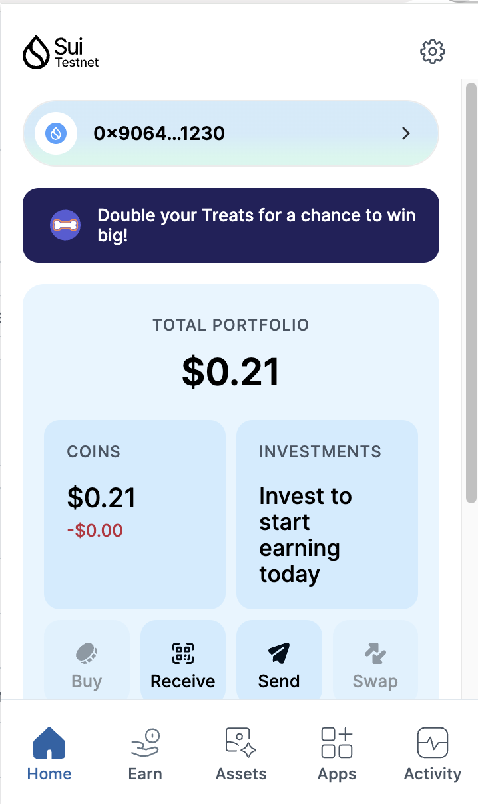
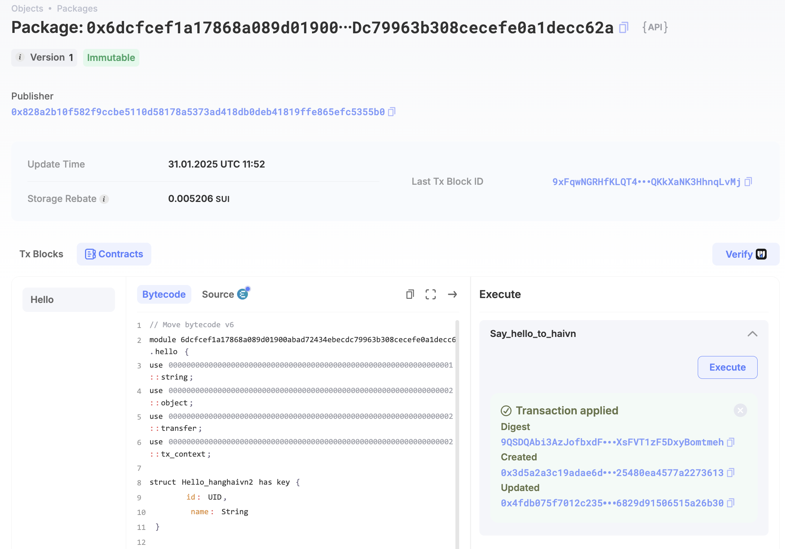

## Basic Information
- Sui Wallet Address: `0x9064b25f645bb2d67600568a6e12188fb2ba3992aa78e08730b03c841c3c1230`
> First-time participants must complete the registration of the wallet address through the first task to have it merged. You should use this address for subsequent tasks. We will also use this address to credit the learning rewards.
- Github: `hanghaivn2`

## Personal Introduction
- Work Experience: `0 Years`
- Tech Stack: `Python`, `Solidity`, `Move`
> Important: Competing in a blockchain hackathon sparked my passion for decentralized applications. Move is the language I’m exploring to build innovative, secure solutions.
- Discord: `I'm Burton`

## Tasks

### 01 hello move
- [x] Sui CLI Version: sui 1.41.0
- [x] Sui Wallet Screenshot: 
- [x] Package ID: 0x6dcfcef1a17868a089d01900abad72434ebecdc79963b308cecefe0a1decc62a
- [x] Package ID's Screenshot from Explorer: 

### 02 move coin
- [x] `My Coin` Package ID:0x0819e09316a9a3da43b3c12f4a5417c8b1f18a2a13a740d3b1bf664747dad9c7
- [x] `Faucet Coin` Package ID:0xaa1a42cb792be6600b917eab3fcc6369e7376c002ffe77ad1a4380301aa61760
- [x] Transfer `My Coin` hash:9NAq7KN7Cgk3nPNzpbtcH349bEXkMGL81Foy1RhgB2fW
- [x] `Faucet Coin` address 1 mint hash:DkR1zyCqpvrsNx2Kxh4GmsRxMVEfo51gF4YaZXPerbLK 
- [x] `Faucet Coin` address 2 mint hash:BjQMTvfmm7Si15NGX7N4ief7pLNCCsgCfio23oVaJNax

### 03 move nft
- [x] NFT Package ID:0x9e337896ba4a3004f02c0fe399e3f604ad979f852ff63d9a271a5addb64a28ef
- [x] NFT Object ID:0xe5f3bb3e40be1857be50856d48f95fc32fd01a38584cae79406c0da69c3d5f4a
- [x] Transfer NFT hash:3P2ZLB3BcZn9QoNAxSQnc2n6dEGpYu3uYKHU9MiVZ7bE
- [x] NFT's Screenshot from Explorer: 

### 04 move game
- [x] Game Package ID:0xdd1db35e1539a39668f89a307ec011cf8739d7cedd65d8b9de3ae8d2d68cad7b
- [x] Deposit Coin Hash:4Kr5aa3jZr6LTBncAzTUbuwY7GeHnMhum6QZmy1FEbkd
- [x] Withdraw Coin Hash:9uZLcsd4FyWGBGkFPiWiG5BshTNwUYqgLwCkdXY1hkK8
- [x] Play Game Hash:H5PJZazp9rpqPbbySXc9DPF4DQ9NLKn22Mn7rPLu94gt

### 05 move swap
- [x] Swap Package ID:0x75a323c53927d8a442c8d00b780adc46670373010f84f60a4e800331284fcc44
- [x] Call Swap Coin A -> Coin B hash:Dej4Hehr9N6pDjNEYQeoFMcbxVAWMtpejEDGo4DKJf1j
- [x] Call Swap Coin B -> Coin A hash:EH7Nk494J8v1EXVSttLPVqNeWjv94cBQ1vKWUkDEVVJX

### 06 dapp-kit SDK PTB
- [x] Save Hash:5DuuEEBqKXei2WBdW5kDCJB18FMkNfi2G1QtQYBNWMoF
