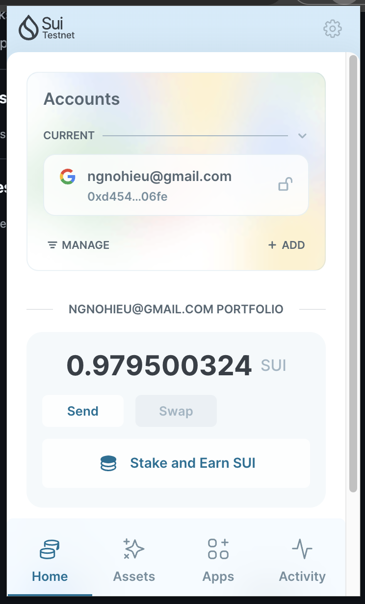
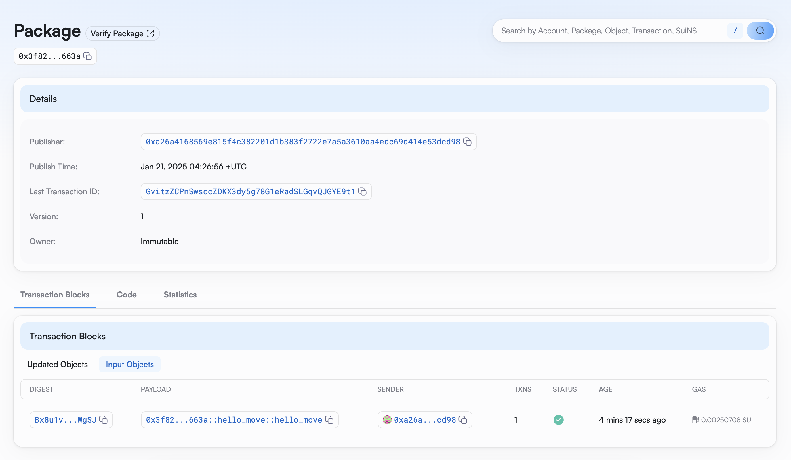
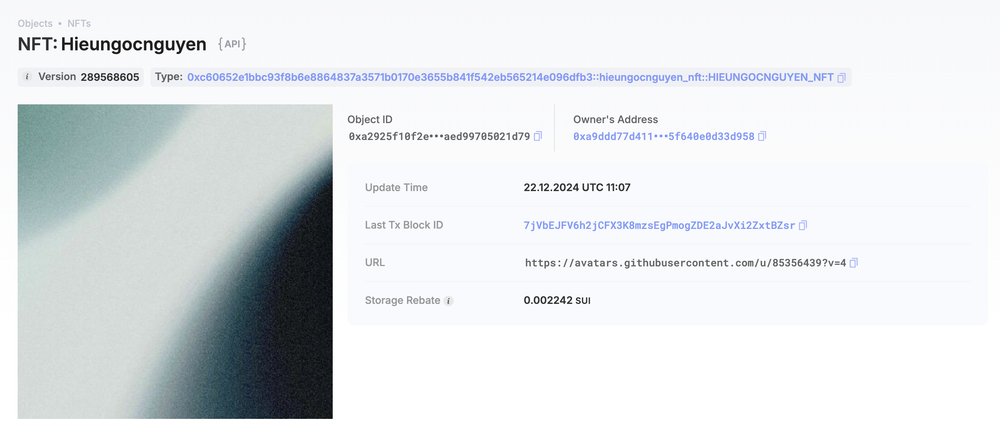

## Basic Information
- Sui Wallet Address: `0xa26a4168569e815f4c382201d1b383f2722e7a5a3610aa4edc69d414e53dcd98`
- Github: `hieungocnguyen`

## Personal Introduction
- Work Experience: `1 years`
- Tech Stack: `Javascript` `React` `Nodejs` , etc.
- Experienced in web2 development, passionate about creating useful products. With my interest in blockchain, i will add it to my skillset in my career and Move will be one of them, hope this will be an interesting journey
- Contact: telegram `hieungocnguyen`

## Tasks

### 01 hello move
- [x] Sui CLI Version: sui 1.41.0-homebrew
- [x] Sui Wallet Screenshot: Link to image uploaded to `images` folder.

- [x] Package ID: 0x3f828f20d39ef8caeed6dcf5ee30b6b25645c46b7f0b13b1aec62eb145df663a
- [x] Package ID's Screenshot from Explorer: Link to image uploaded to `images` folder.

### 02 move coin
- [x] `My Coin` Package ID: 0xd68f446c99d06e4a14358d5ee20fa7a939107f724bc16bf9f5034ad316beb997
- [x] `Faucet Coin` Package ID: 0x4b91c8395eabc57d92dbe2d033a0ae15a7383d13adc65342d45d9155a40d4bbc
- [x] Transfer `My Coin` hash: 4ZN79bod3ob7LGpRG2iAgBMEXwGBbVUdvuaYxpujs9xi
- [x] `Faucet Coin` address 1 mint hash: 5srC8MMizvbL8NbZUbaXqmqtsaAUj79iQYLWwdgxgRAY
- [x] `Faucet Coin` address 2 mint hash: mZG91rs6f6qE3ZLhQcpsfQaJJ6Sv4gmacMFsNh3ZhVu

### 03 move nft
- [x] NFT Package ID: 0xc60652e1bbc93f8b6e8864837a3571b0170e3655b841f542eb565214e096dfb3
- [x] NFT Object ID: 0xa2925f10f2e35deffcc3a04b79d71466f1b14a7b928b167124aed99705021d79
- [x] Transfer NFT hash: 7jVbEJFV6h2jCFX3K8mzsEgPmogZDE2aJvXi2ZxtBZsr
- [x] NFT's Screenshot from Explorer: Link to image uploaded to `images` folder.

### 04 move game
- [x] Game Package ID: 0xc115f7a8066043bc4ec0128fd03678bcddd0e6390a58c751896a28ce8eccbf34
- [x] Deposit Coin Hash: 4vdTJLk13wrb9eyAcGf7eKCS2RefK1NsbhyVfY4C415h
- [x] Withdraw Coin Hash: 5gragW5tNaLUrJxfsyvWJbENQQCGeNkiSawhmL9KcsEc
- [x] Play Game Hash: EoAYKFsWad3WG6b8UrcGEGN3V3q5K7sF5BGdSwRLYYkY

### 05 move swap
- [x] Swap Package ID: 0x8b32585ea652c841caf4f9e92469e1de670de9919eaccc86c7b12adae31bb289
- [x] Call Swap Coin A -> Coin B hash: BwkP1yG1jo2EKdmLxwT6pP3jiiTeUxHpFe5hrVYCjeFj
- [x] Call Swap Coin B -> Coin A hash: 8D7r8kZpzej11PD5YGPZJ3o8S53P2CyboDibivVqPYN8

### 06 dapp-kit SDK PTB
- [x] Save Hash: BNeBiJ7PCmchDhZvWvmPE1HdLFLEgTKvQs6SD34CsPpK
