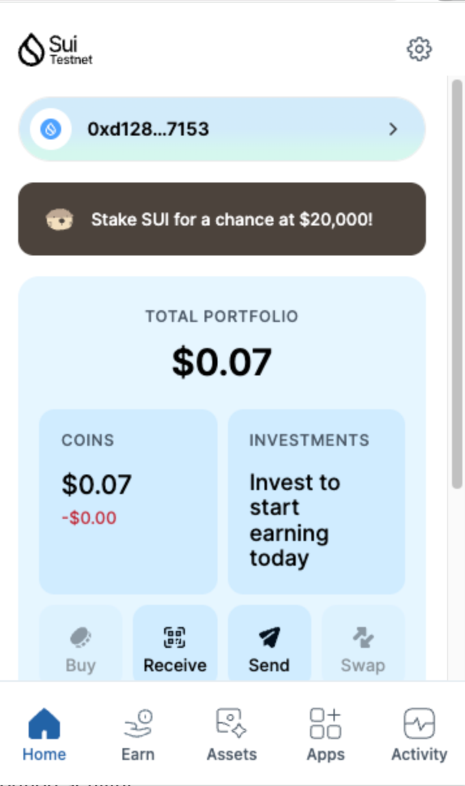
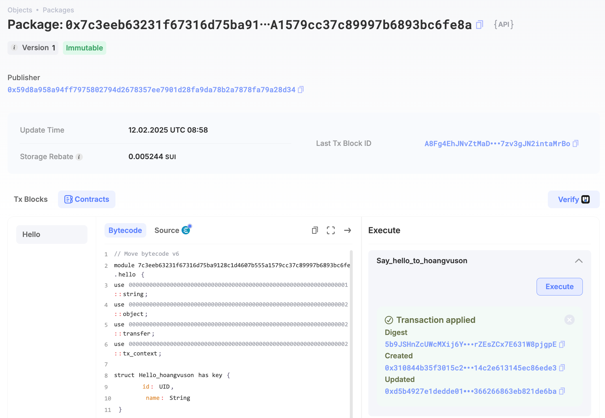
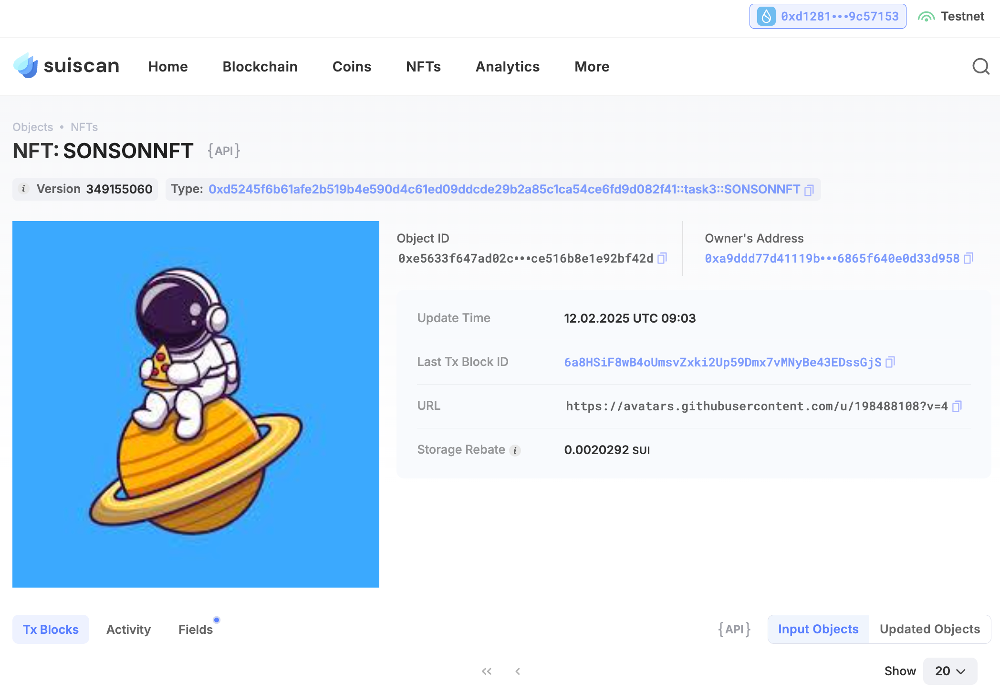

## Basic Information
- Sui Wallet Address: `0xd1281213126e71eb3eeb311ba25e77859b4edebbdb2cbfabb3c4ab0409c57153`
> First-time participants must complete the registration of the wallet address through the first task to have it merged. You should use this address for subsequent tasks. We will also use this address to credit the learning rewards.
- Github: `hoangvuson`

## Personal Introduction
- Work Experience: `2 years`
- Tech Stack: `Python`, `Solidity`, `Move`
> Breaking things, fixing them, and learning along the way. Exploring Move’s security model and Sui’s scalability. Hack first, build better!
- Discord: `Son son`

## Tasks

### 01 hello move
- [x] Sui CLI Version: sui 1.42.0
- [x] Sui Wallet Screenshot: 
- [x] Package ID:0x7c3eeb63231f67316d75ba9128c1d4607b555a1579cc37c89997b6893bc6fe8a
- [x] Package ID's Screenshot from Explorer: 

### 02 move coin
- [x] `My Coin` Package ID:0x25f0d927081d4fa2f152c556046842eb5c6b3b1b8bdabdbb07576883e9a2b7d8 
- [x] `Faucet Coin` Package ID:0xe97bef45d1c5d65537b0dde52e35cd0b231aa59f7b1efcf8466eabf104aaf9c4
- [x] Transfer `My Coin` hash:6R4gM4ZG2DWVqf9D95cfW2LCQZBAArYcbs7bMP3B9Zy1
- [x] `Faucet Coin` address 1 mint hash:9yu96oaG4qo2VA2GGPebFZRrLsSgDnSJ3BQ7TyuTZMC8
- [x] `Faucet Coin` address 2 mint hash:8KDoEoasdzCuJJ9q4ibWwxqtYkhgjaPYtHteoEhVyjb

### 03 move nft
- [x] NFT Package ID:0xd5245f6b61afe2b519b4e590d4c61ed09ddcde29b2a85c1ca54ce6fd9d082f41
- [x] NFT Object ID:0xe5633f647ad02c69be9d050e9d496b8b0cccab836f0053cce516b8e1e92bf42d
- [x] Transfer NFT hash:6a8HSiF8wB4oUmsvZxki2Up59Dmx7vMNyBe43EDssGjS
- [x] NFT's Screenshot from Explorer: 

### 04 move game
- [x] Game Package ID:0x6f4122196c23cfdfbd8ad975844ff5b7d0db920babe077e9d7658d39e02f6877
- [x] Deposit Coin Hash:GfLpB1C6LvVwgrAfjDjQx2JartBcJPrQWmu2L6tLDBya
- [x] Withdraw Coin Hash:ATxVSWA8bw4Rms3YXRFMhVQ39NuMNWwvH96XQkCPX5Ye
- [x] Play Game Hash:9M2sUCwCZsrkbwU4T5kAVPbirihKYzTg1s4pqwxk2Teg

### 05 move swap
- [x] Swap Package ID:0xbdc4b495f7bbba9dfdf87f13c70af08e4a324357a31d66009a617a7e11eb09b0
- [x] Call Swap Coin A -> Coin B hash:6mWki4avxk36MRYpE9AEZ3nNwifRWyZdbzqKpQ1f5SnL
- [x] Call Swap Coin B -> Coin A hash:67BpCqVwj2N3hT6QAuhALJwxoE6L2dikb4apKTFAtXCV

### 06 dapp-kit SDK PTB
- [x] Save Hash:H5fB33LbEThMrfMXmFPFYr9F4mJnQoAoEU8JDr9rq4RR
