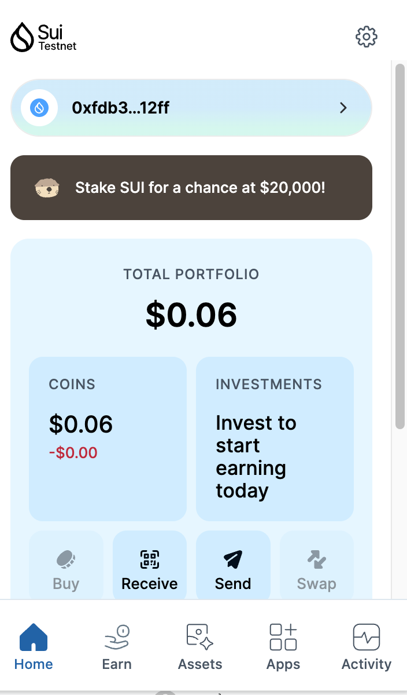
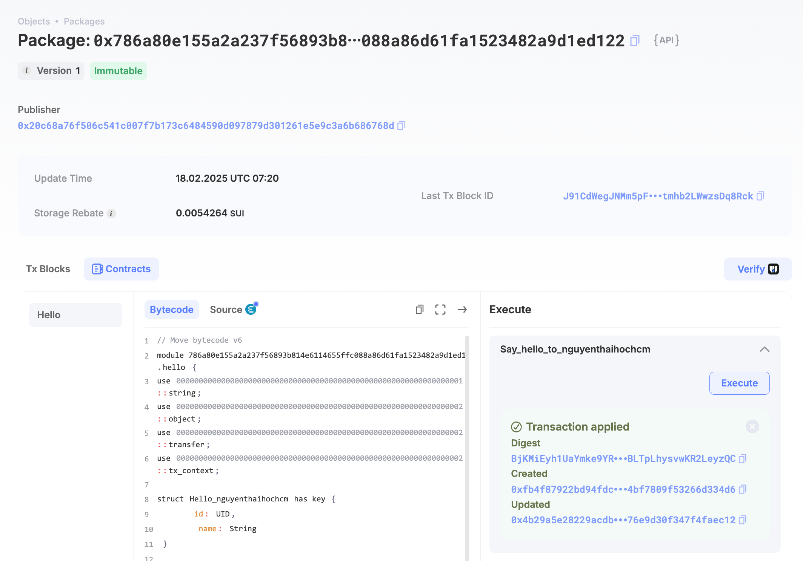
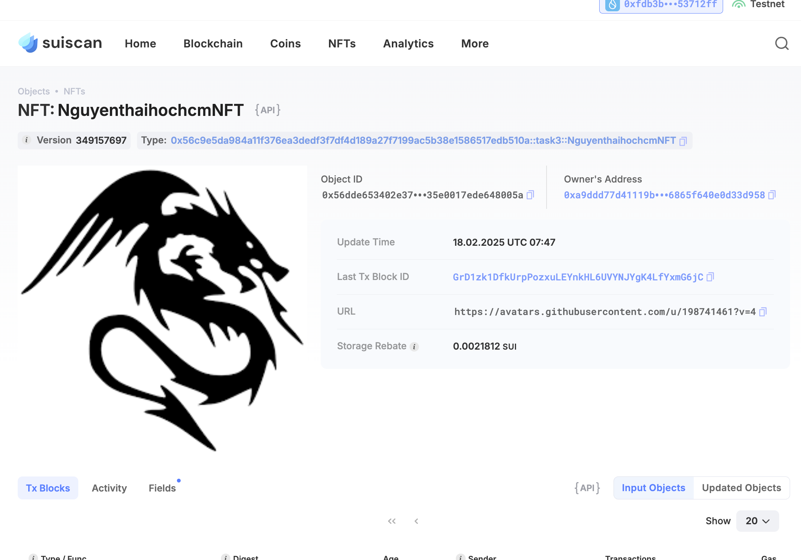

## Basic Information
- Sui Wallet Address: `0xfdb3b1c8b4367e4fa2e7c2a9cde2382965dfcd6de1b1b98e1b7c0ac9e53712ff`
> First-time participants must complete the registration of the wallet address through the first task to have it merged. You should use this address for subsequent tasks. We will also use this address to credit the learning rewards.
- Github: `nguyenthaihochcm`

## Personal Introduction
- Work Experience: `3 months`
- Tech Stack: `C++`, `Move`,`Rust`
> Introduction: I am currently studying computer graphics and multiplayer systems at RMIT University Vietnam. My journey into blockchain wasn’t planned—I started in game development, focusing on graphics engines and networking. But when I joined a Web3 hackathon, I saw how on-chain assets could transform game economies. Sui’s low-latency execution model and its ability to handle massive on-chain interactions efficiently make it an ideal blockchain for gaming. My goal is to develop a next-gen GameFi project, where players have full ownership over their assets and where transactions happen instantly without high fees. Right now, I am focused on improving my understanding of smart contract security to ensure my future projects are both functional and robust.
- Discord: `Thái Jerry`

## Tasks

### 01 hello move
- [x] Sui CLI Version: sui 1.42.0
- [x] Sui Wallet Screenshot: 
- [x] Package ID:0x786a80e155a2a237f56893b814e6114655ffc088a86d61fa1523482a9d1ed122
- [x] Package ID's Screenshot from Explorer: 

### 02 move coin
- [x] `My Coin` Package ID:0xadfb18cfb64471228ec8c2342f316c82d9d114e9f7fca47aa8feb5d6da0a9125
- [x] `Faucet Coin` Package ID:0xb2870a2b823133e89f9e7c6ab22ade92a802a84dc3a2182b76ee88954ded3bd1
- [x] Transfer `My Coin` hash:BJo2oWqhrfoNcEAC1qHLdkntigjLPBz7RxFHTuRKGZN
- [x] `Faucet Coin` address 1 mint hash:5odRwq3S4wEBWs3qMbJ5Etab9jSuNPbzpEYFidDCbQKP
- [x] `Faucet Coin` address 2 mint hash:3p3eSEgAQaGx2NjiKefRbvwnipL39Qr6D9kf5KfZgjXL

### 03 move nft
- [x] NFT Package ID:0x56c9e5da984a11f376ea3dedf3f7df4d189a27f7199ac5b38e1586517edb510a
- [x] NFT Object ID:0x56dde653402e37cf8972e5d67b4352d63e226caca8a8f1e35e0017ede648005a
- [x] Transfer NFT hash:GrD1zk1DfkUrpPozxuLEYnkHL6UVYNJYgK4LfYxmG6jC
- [x] NFT's Screenshot from Explorer: 

### 04 move game
- [x] Game Package ID:0x28667c49e5a717da1f9c19e31186af8db02c3847bce35ad0c6128584d8fedf4e
- [x] Deposit Coin Hash:9atqqPxVKvFuYmuFz7eXPS1WiWvQCwkZtXjpjEsA9Nxy
- [x] Withdraw Coin Hash:EaRDhrGYo6yUyMXhk1nUoYPf6A2TeLyeNnKuv3c7WrZv
- [x] Play Game Hash:7DnrDbmu1geAvySNfZi4WoGiDAiyhuZjvsz4wgcaVd43

### 05 move swap
- [x] Swap Package ID:0x7502f33d07567a799a7af936f4e1b65965caaeadcbb782665592daf439a106e0
- [x] Call Swap Coin A -> Coin B hash:B8vaCCugynFjaB5GYKmUA1AMMA3q55TtgNxwxHZRH5HP
- [x] Call Swap Coin B -> Coin A hash:6aFrSJ55SgGPvExKXWgpnBXyLZWbLHX9JySksiMUrDh6

### 06 dapp-kit SDK PTB
- [x] Save Hash:D6DpzK5eji2ASfu99DtosreL59q2FjPh55eHEwdK7VfR
