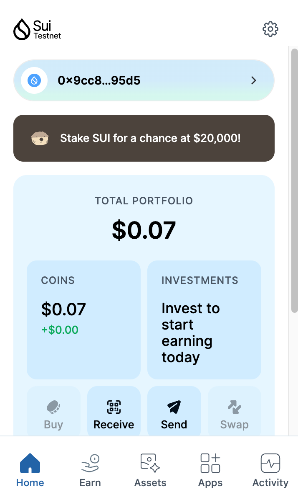
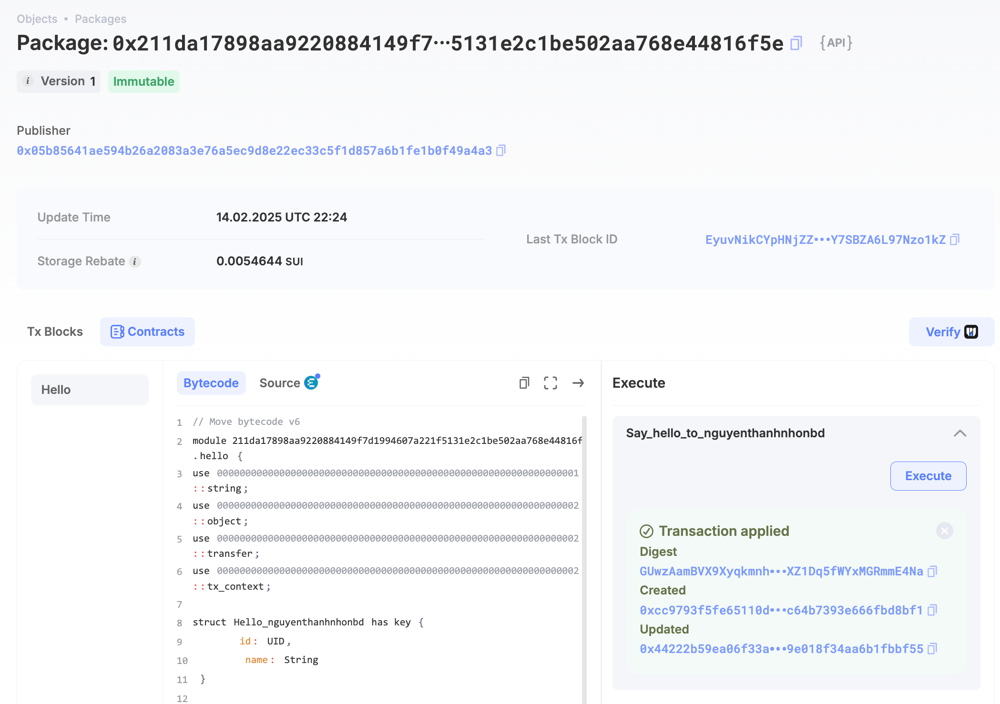
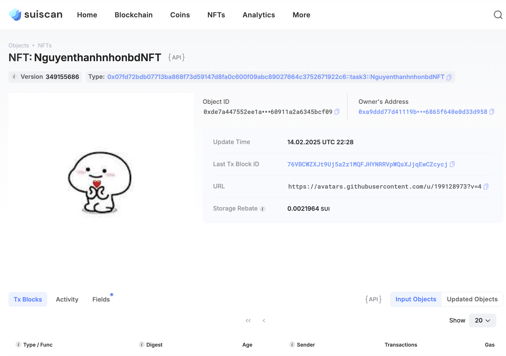

## Basic Information
- Sui Wallet Address: `0x9cc85b6f4b9dc0761583910b10d075c06175ff6ca5450d447165eda8a3d895d5`
> First-time participants must complete the registration of the wallet address through the first task to have it merged. You should use this address for subsequent tasks. We will also use this address to credit the learning rewards.
- Github: `nguyenthanhnhonbd`

## Personal Introduction
- Work Experience: `6 months`
- Tech Stack: `Security Audits`, `Move`, `Rust`
> Introduction: Security is at the heart of blockchain adoption. With years of experience auditing smart contracts, I’m now exploring Move to understand its unique security properties and how they improve over traditional contract languages. My mission is to contribute to a safer Web3 ecosystem, ensuring Sui dApps are resilient against vulnerabilities. Let’s build with security in mind!
- Discord: `Thạnh Nhơn`

## Tasks

### 01 hello move
- [x] Sui CLI Version: sui 1.42.0
- [x] Sui Wallet Screenshot: 
- [x] Package ID:0x211da17898aa9220884149f7d1994607a221f5131e2c1be502aa768e44816f5e
- [x] Package ID's Screenshot from Explorer: 

### 02 move coin
- [x] `My Coin` Package ID:0xef29c2c60076cf635a964fae7e6327247ea42a25d5f4f99a21b7b451089c71ed
- [x] `Faucet Coin` Package ID:0x6d451d5d52ca6e516fb0aa6f44d7c3d244047f2d5c5b29c22959f7d93f604756
- [x] Transfer `My Coin` hash:EiEoyfTV2ZxR4jw7pjGLg1hu3YZDqyaPX3hCXznSnFKt
- [x] `Faucet Coin` address 1 mint hash:4dK4KkpqGV3AA6JQ1pRWKDg6PYMEC1uHtDCq3S3H1vKG
- [x] `Faucet Coin` address 2 mint hash:CrquBd99dCMz3j7Hf78bFj97QudsCJMffhtbuiqV98Aa

### 03 move nft
- [x] NFT Package ID:0x07fd72bdb07713ba868f73d59147d8fa0c600f09abc89027664c3752671922c6
- [x] NFT Object ID:0xde7a447552ee1a87e51cea32bcefaad9bb14d9ebfb93de160911a2a6345bcf09
- [x] Transfer NFT hash:76VBCWZXJt9Uj5a2z1MQFJHYNRRVpWQsXJjqEwCZcycj
- [x] NFT's Screenshot from Explorer: 

### 04 move game
- [x] Game Package ID:nguyenthanhnhonbd_game
- [x] Deposit Coin Hash:8gazEEFNLN6ikxULA5FUtqLopMekdumaPEkFq1GJbBnq
- [x] Withdraw Coin Hash:6Bzmz1hSCKSTEFpoZyq6UobMY93hnHZhx9d5bjw87GHt
- [x] Play Game Hash:9Pd6Z5D3R5vZLJZHQmhVrVfTYHMzoTayHQbD1ewgUKh3

### 05 move swap
- [x] Swap Package ID:0xda397bb3322ac361b67331556013b6d8b33aababe1e02c97478e0ca8c46ffff5
- [x] Call Swap Coin A -> Coin B hash:BK3WVz17DMV5M6k7ybjPH4U9vHeMR45uTzjPfrFJFjrF
- [x] Call Swap Coin B -> Coin A hash:JBx5YRihvVtdb5ruZgH6uqxxKKxyToZWdPMbU5D1cUzs

### 06 dapp-kit SDK PTB
- [x] Save Hash:1RvnMtHDp931ZQ32UxrtNpX5SKHb3Ciuj6TYRw2AYL3
