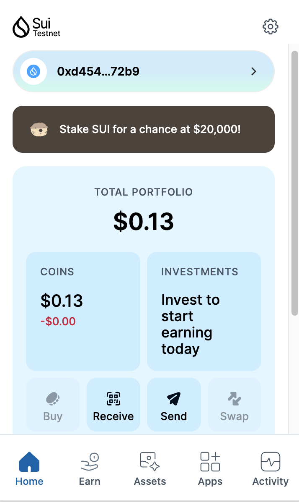
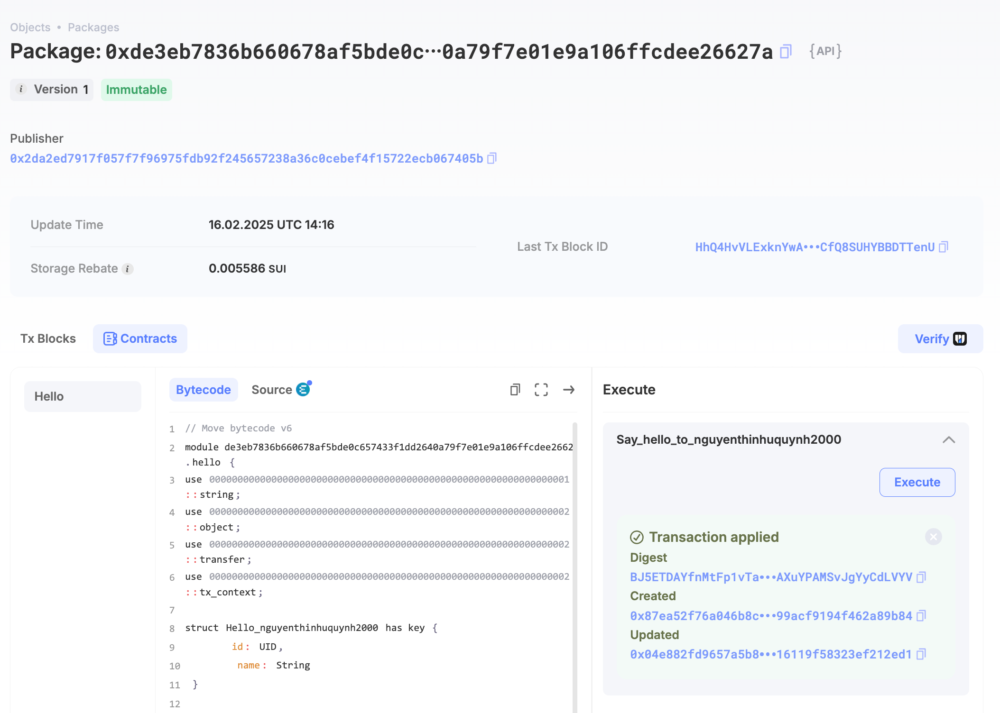
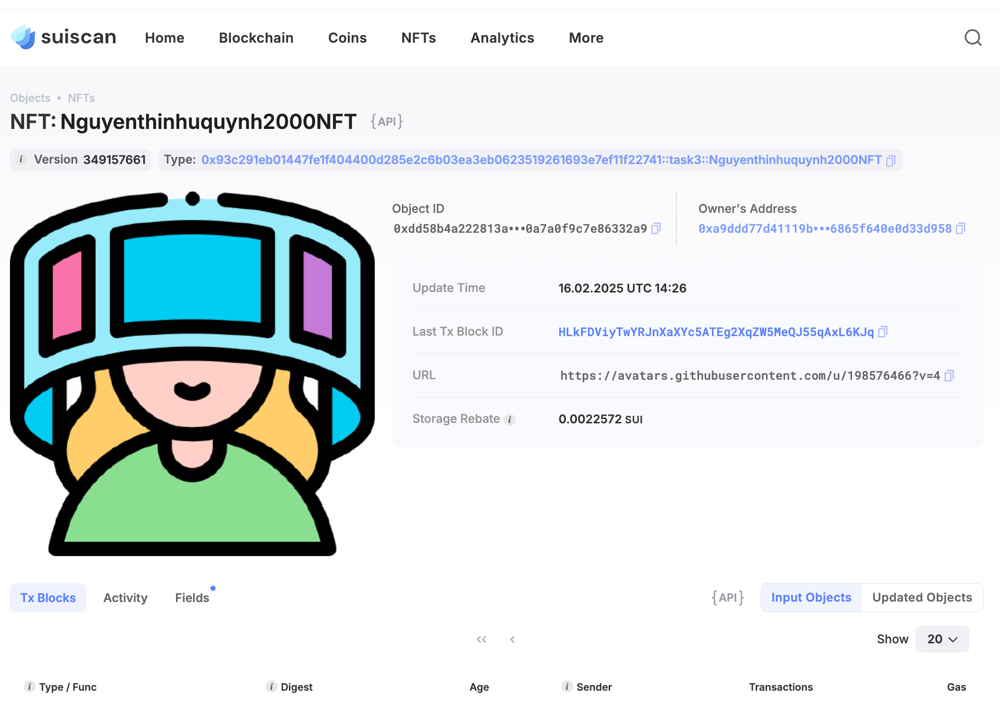

## Basic Information
- Sui Wallet Address: `0xd454a4e534383973467753fee7bd54d89271403a1656382a532c92b28f6d72b9`
> First-time participants must complete the registration of the wallet address through the first task to have it merged. You should use this address for subsequent tasks. We will also use this address to credit the learning rewards.
- Github: `nguyenthinhuquynh2000`

## Personal Introduction
- Work Experience: `3 yrs`
- Tech Stack: `Move`, `JavaScript`, `TypeScript`
> I’ve been coding backend for a while, but I truly believe Web3 is the future. When I learned about Move’s ownership and security advantages over Solidity, I decided to dive into Sui. At first, Move seemed tricky, but once I got the hang of it, I realized how much safer smart contracts could be!
Discord: `Clifford Vang`

## Tasks

### 01 hello move
- [x] Sui CLI Version: sui 1.42.0
- [x] Sui Wallet Screenshot: 
- [x] Package ID:0xde3eb7836b660678af5bde0c657433f1dd2640a79f7e01e9a106ffcdee26627a
- [x] Package ID's Screenshot from Explorer: 

### 02 move coin
- [x] `My Coin` Package ID:0x60684c7219ad984e5e628b5e892d037ba2add6300a8f69e7851249ca4f1b76cc
- [x] `Faucet Coin` Package ID:0x18300e00d43ef4855bce857824a158c767c772d4c4c97311f405a2cf071485f3
- [x] Transfer `My Coin` hash:DbqmXtejmGQXaeMTyEWqXBm8iJP4sbqmhnSLkX2UzzRN
- [x] `Faucet Coin` address 1 mint hash:3WAZ3HUgfSMB51WayQxYPYa5VF44XpDzXpBTakq1N4ar
- [x] `Faucet Coin` address 2 mint hash:21GUuyiaLXWr5raQQQtKTC3JoAMmaJyetAr4AwBCH6zQ

### 03 move nft
- [x] NFT Package ID:0x93c291eb01447fe1f404400d285e2c6b03ea3eb0623519261693e7ef11f22741
- [x] NFT Object ID:0xdd58b4a222813a86fd88ec07de033880cd613120036ec5b0a7a0f9c7e86332a9
- [x] Transfer NFT hash:HLkFDViyTwYRJnXaXYc5ATEg2XqZW5MeQJ55qAxL6KJq
- [x] NFT's Screenshot from Explorer: 

### 04 move game
- [x] Game Package ID:0x8b9b9ae36262b2fedaae10cc0173f1abd4a6000fa651631fe91cc25bd548adcd
- [x] Deposit Coin Hash:A6us8Rn9MqYtsX77ptdBRridpRyY4jzwvSsntKCW7od3
- [x] Withdraw Coin Hash:6sxyqCCZqB7amtvM6i2eMTxwcYVrnCGHo3A5y4RHT7SU
- [x] Play Game Hash:GxAzWUKf41HZmDvXnMjgd1NY13PCaHi9veFKrve8NzET

### 05 move swap
- [x] Swap Package ID:0xab4c24fb5ec622dae54ff9b62e56b318274719bef2900ba285ec54d124e337c9
- [x] Call Swap Coin A -> Coin B hash:DkqSrLmBtn5A1oidpVw5Y4UNQVqZvd9dvajZG54nvKSW
- [x] Call Swap Coin B -> Coin A hash:6cHPZZXhoVgLPQ7x7zwiKLPuw3RNZ4oFBbyH4gTNDsKJ

### 06 dapp-kit SDK PTB
- [x] Save Hash:HMb6N6QL62GTewAZc8i8mnPNajtfnUbd1bKM2nvczvFJ
