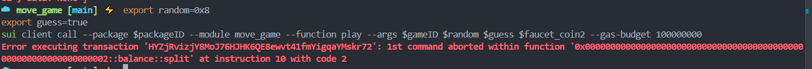

## How to test the **move_game** package

1. Create the **move_game** package
```sh
cd ~/mover-nhoc20170861/mover/nhoc20170861/code/task3
sui move new move_game
```
- The structure of the `move_game` package is as follows:
```sh
.
├── Move.toml
├── sources
│   └── move_game.move
└── tests
    └── move_nft_tests.move
```
- Modify file [`move_game.move`](mover/nhoc20170861/code/task4/move_game/sources/move_game.move) and write your source code 

2. Build your **move_game** package
```sh
cd ~/mover/nhoc20170861/code/task4/move_game 
# build this package
sui move build
```

Output:
```sh
UPDATING GIT DEPENDENCY https://github.com/MystenLabs/sui.git
INCLUDING DEPENDENCY Sui
INCLUDING DEPENDENCY MoveStdlib
BUILDING move_game
```

3. Publish your package
- Publish the package (*I publish to the testnet*):
```sh
sui client publish --with-unpublished-dependencies
```
> [!NOTE]  
> I publish to the **testnet** network


4. Test this package:

- Export new environment

```sh
# Export new environment after publishing module
export packageID=0x5c3367947d6322916b38f007c0e60bc1f8da02a318cfa9f7d125f3bc23f2f77b
export gameID=0x5f4986a11c29faa5705ce5bc7b24a57387e2e264cc7391f5f7b684bb95701423
export adminID=0x7ea50a7544be2b7527ae138e1cd341eb2f6b968f4b2efa370de16c9f79e0f335
```

- Mint faucet_coint

```sh
# export sui cli current address, package id of faucet_coin and treasury created from task 2
export treasury=0x4cff8dda6e54dfac06dde2f4d340c39f91570c15bf369429f1694ce20b0c79db
export sui_cli_address=0xe5209f6d7c0ff44257cb20051438748c96826e6b2acf4f0b0fa7280923e96c9b
export faucet_coinID=0x81526d8512cd7e19610653ab8c3677da5dc6920fa4a168229d99d9f0cfddb658
export faucet_ammount=2000000000

# call function
sui client call --package $faucet_coinID --module faucet_coin --function mint_token --args $treasury $faucet_ammount $sui_cli_address

# Then export faucet_coint after creating
export faucet_coin1=0xb70c9d34967ce4413c8efd4ff45eaafeeb23986c59d17f2e6bbfc0343fb4aa7f
export faucet_coin2=0xe601148077d94ae669384c98a11491dee6907f2fb7d1ddf720226ce8c1d17cd8
```

> *Test deposit*

```sh
export amount1=10000
export amount2=100000
sui client call --package $packageID --module move_game --function deposit --args $gameID  $faucet_coin1 $amount1
sui client call --package $packageID --module move_game --function deposit --args $gameID  $faucet_coin2 $amount2
```

Check balance of this game
```
sui client object $gameID
# ouput
╭───────────────┬─────────────────────────────────────────────────────────────────────────────────────────────────────────────────────╮
│ objectId      │  0x5f4986a11c29faa5705ce5bc7b24a57387e2e264cc7391f5f7b684bb95701423                                                 │
│ version       │  289573256                                                                                                          │
│ digest        │  GCRnX88CXa4PGsCx5BAaMVhzYCJBPtUaJVYrFZcheGoM                                                                       │
│ objType       │  0x5c3367947d6322916b38f007c0e60bc1f8da02a318cfa9f7d125f3bc23f2f77b::move_game::Game                                │
│ owner         │ ╭────────┬──────────────────────────────────────────╮                                                               │
│               │ │ Shared │ ╭────────────────────────┬─────────────╮ │                                                               │
│               │ │        │ │ initial_shared_version │  289573241  │ │                                                               │
│               │ │        │ ╰────────────────────────┴─────────────╯ │                                                               │
│               │ ╰────────┴──────────────────────────────────────────╯                                                               │
│ prevTx        │  BFa6aiY9449B717kWVxSFMgmCQoEqJuiqa4fJHuftek9                                                                       │
│ storageRebate │  1352800                                                                                                            │
│ content       │ ╭───────────────────┬─────────────────────────────────────────────────────────────────────────────────────────────╮ │
│               │ │ dataType          │  moveObject                                                                                 │ │
│               │ │ type              │  0x5c3367947d6322916b38f007c0e60bc1f8da02a318cfa9f7d125f3bc23f2f77b::move_game::Game        │ │
│               │ │ hasPublicTransfer │  true                                                                                       │ │
│               │ │ fields            │ ╭─────────┬───────────────────────────────────────────────────────────────────────────────╮ │ │
│               │ │                   │ │ balance │  101900                                                                       │ │ │
│               │ │                   │ │ id      │ ╭────┬──────────────────────────────────────────────────────────────────────╮ │ │ │
│               │ │                   │ │         │ │ id │  0x5f4986a11c29faa5705ce5bc7b24a57387e2e264cc7391f5f7b684bb95701423  │ │ │ │
│               │ │                   │ │         │ ╰────┴──────────────────────────────────────────────────────────────────────╯ │ │ │
│               │ │                   │ ╰─────────┴───────────────────────────────────────────────────────────────────────────────╯ │ │
│               │ ╰───────────────────┴─────────────────────────────────────────────────────────────────────────────────────────────╯ │
╰───────────────┴─────────────────────────────────────────────────────────────────────────────────────────────────────────────────────╯
```

> *Test withdraw*

```sh
export amount_withdraw=10000
sui client call --package $packageID --module move_game --function withdraw --args $gameID  $adminID $amount_withdraw
```

> *Test play function*

```sh
export random=0x8
export guess=true
sui client call --package $packageID --module move_game --function play --args $gameID $random $guess $faucet_coin2 --gas-budget 1000000000
```

> [NOTE]
> REWARD value is 1 SUI (10^9 gas) So when the customer answers incorrectly if there aren't enough coins, you'll get an error when calling the split function inside the deposit method
