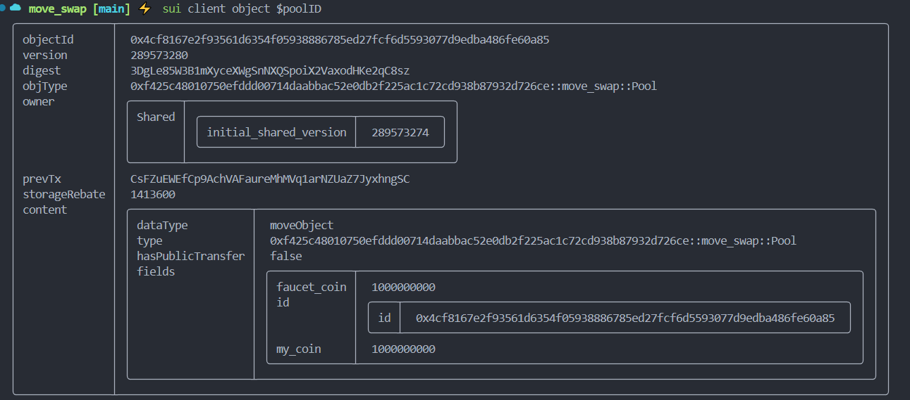

## How to test the **move_swap** package

1. Create the **move_swap** package
```sh
cd ~/mover-nhoc20170861/mover/nhoc20170861/code/task2
sui move new move_swap
```
- The structure of the `move_swap` package is as follows:
```sh
.
├── Move.toml
├── sources
│   └── move_swap.move
└── tests
    └── move_coin_tests.move
```
- Modify file [`move_swap.move`](mover/nhoc20170861/code/task5/move_swap/sources/move_swap.move) and write your source code 

2. Build your **move_swap** package
```sh
cd ~/mover/nhoc20170861/code/task5/move_swap 
# build this package
sui move build
```

Output:
```sh
UPDATING GIT DEPENDENCY https://github.com/MystenLabs/sui.git
INCLUDING DEPENDENCY Sui
INCLUDING DEPENDENCY MoveStdlib
BUILDING move_swap
```

3. Publish your package and test it
- Publish the package (*I publish to the testnet*):
```sh
sui client publish
```
> [!NOTE]  
> I publish to the **testnet** network


4. Test this package:
  
  - Export new environment
```sh
#get my_coin and faucet_coin from task2
export treasury_my_coin=0x76eefb2117a4600b3119ff7e361e05400790342800cf9919a4ab721230cb02ef
export treasury_faucet_coin=0x4cff8dda6e54dfac06dde2f4d340c39f91570c15bf369429f1694ce20b0c79db
export my_coin_packageID=0x22f468520532bc30fb69c1cb50df08981273a313f8549e42e7b332f658b8bd47
export faucet_coin_packageID=0x81526d8512cd7e19610653ab8c3677da5dc6920fa4a168229d99d9f0cfddb658

export sui_cli_address=0xe5209f6d7c0ff44257cb20051438748c96826e6b2acf4f0b0fa7280923e96c9b

# these values will be shown when you publish your module
export poolID=0x4cf8167e2f93561d6354f05938886785ed27fcf6d5593077d9edba486fe60a85
export packageID=0xf425c48010750efddd00714daabbac52e0db2f225ac1c72cd938b87932d726ce
```

  - Test  call Swap my_coin -> faucet_coin

#### Step 1: Create two new my_coin coins and two new feucet_coin coins
```sh
# call this command two times and store the objectID of each my_coin coin
sui client call --package $my_coin_packageID --module my_coin --function mint_token --args $treasury_my_coin 1000000000 $sui_cli_address

# call this command two times and store the objectID of each faucet_coin coin
sui client call --package $faucet_coin_packageID --module faucet_coin --function mint_token --args $treasury_faucet_coin 1000000000 $sui_cli_address
```

=> export result as a environment variables::
```sh
export my_coin1=0x827a354153fe800655feea307cf855a30c8242c87f5d6f60b7f200650d82f587
export my_coin2=0xe121cf0b76ebd50b516d83db520c8abe7f3277f6316fbcc4dab4f825061c88f8

export faucet_coin1=0x7bd0a16b8d3de401dc6daa9e355ccb99a31367165eb926f56931d1843e364dd8
export faucet_coin2=0x98005b4711ab3d241952521cb5a50c6b3ea3a24d017070e1e854fa61a6be6ee2
```

#### Step 2: Add money to pool
```sh
sui client call --package $packageID --module move_swap --function add_money_to_pool --args $poolID $my_coin1 $faucet_coin1
```
=> Output:


### Step 3: swap my_coin to faucet_coin
```sh
# Deposit my_coin to the pool and pay the corresponding amount of faucet_coin to the recipient
sui client call --package $packageID --module move_swap --function swap_my_coin_to_faucet_coin --args $poolID $my_coin2
```

### Step 4: swap faucet_coin to my_coin 
```sh
# Deposit faucet_coin to the pool and pay the corresponding amount of my_coin to the recipient
sui client call --package $packageID --module move_swap --function swap_faucet_coin_to_my_coin --args $poolID $faucet_coin2
```sh