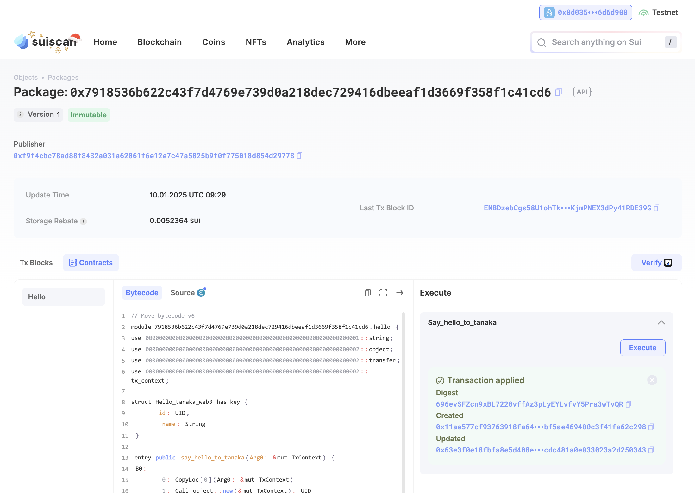
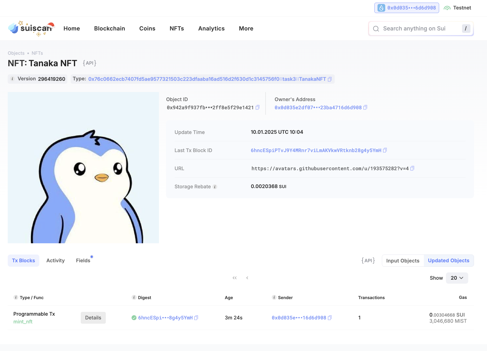

## Basic Information
- Sui Wallet Address: `0x0d035e2df07e251978b589672355b45801e1e65417f102977423ba4716d6d908`

- Github: `Tanaka-web3`

## Personal Introduction
- Work Experience: `1 years`
- Tech Stack: `Rust` `C++` `Python` `TypeScript` `Move`
> I'm a software engineer with 1 years of experience in web2 development, particularly interested in Move, aiming to use Move as an entry point into blockchain.
- Discord: `Tanaka-web3`

## Tasks

### 01 hello move
- [x] Sui CLI Version: sui 1.39.3
- [x] Sui Wallet Screenshot: 
- [x] Package ID: 0x7918536b622c43f7d4769e739d0a218dec729416dbeeaf1d3669f358f1c41cd6
- [x] Package ID's Screenshot from Explorer: 

### 02 move coin
- [x] `My Coin` Package ID: 0x10aecc0dda494ca0de942d16bf37b079c2e58623f8ae3e0715dab8db97009802
- [x] `Faucet Coin` Package ID: 0x4fc1190e2aacdcc56a4009e6de2d4926e9ee908ac1fec8e30466ed2704c567a0
- [x] Transfer `My Coin` hash: J6BEhBUubN4MLScz6JnmSEZpQoQ1VpgMbmM9yKBExQNH 
- [x] `Faucet Coin` address 1 mint hash: 7msCcatt9Ndg88vBHXc3nW2LhE1tFd24Wu6jxUYeNnpM
- [x] `Faucet Coin` address 2 mint hash: 8koy68NRS47ZsR7b1XzbDnmwT632gsR71u5Hru4gEi4o

### 03 move nft
- [x] NFT Package ID: 0x76c0662ecb7407fd5ae9577321503c223dfaaba16ad516d2f630d1c3145756f0
- [x] NFT Object ID: 0x942a9f937fbb3e2d219fc72f58bfb3b9eca9bc32bf75a17a9d2ff8e5f29e1421
- [x] Transfer NFT hash: 4FTbzDzLbSvUMgYDEXP2Q8WYjM1uqQmCpDcEddLGQ6e7
- [x] NFT's Screenshot from Explorer: 

### 04 move game
- [x] Game Package ID: 0x3004399ddd14c297dd53fc06e6d3e3cd94fa278d60e655a339f03d93ee1c1082
- [x] Deposit Coin Hash: CoZ19HzGRX4bxjaQSp1VJ9VhskXsP4KzkgbyyY71KbHt
- [x] Withdraw Coin Hash: 7UVEgjKPj1xNRqXyRAkMfoSFLcmRi3NHYbMX9pn2PF3B
- [x] Play Game Hash: 4ctQsUWwvjW7vcJ39x55RYmhjZHHemMnadEj2wbm9AzA

### 05 move swap
- [x] Swap Package ID: 0x7bd3eefce01848af6af732b2160775472de4b7637cb302fa9ca4a579f16c17da
- [x] Call Swap Coin A -> Coin B hash: 996HyETTJ88BRAnYLD6r3FtDNMrVC33zVaUjZSNbrgHE 
- [x] Call Swap Coin B -> Coin A hash: 6xYPCiC6S27551egJpmvSUYo947MyV2sKLbMjBzRpxQM

### 06 dapp-kit SDK PTB
- [x] Save Hash: FDpKAr9W2tBziTPEtx9Tx41S5pdRKPw7EKXVYHkFUvFY
