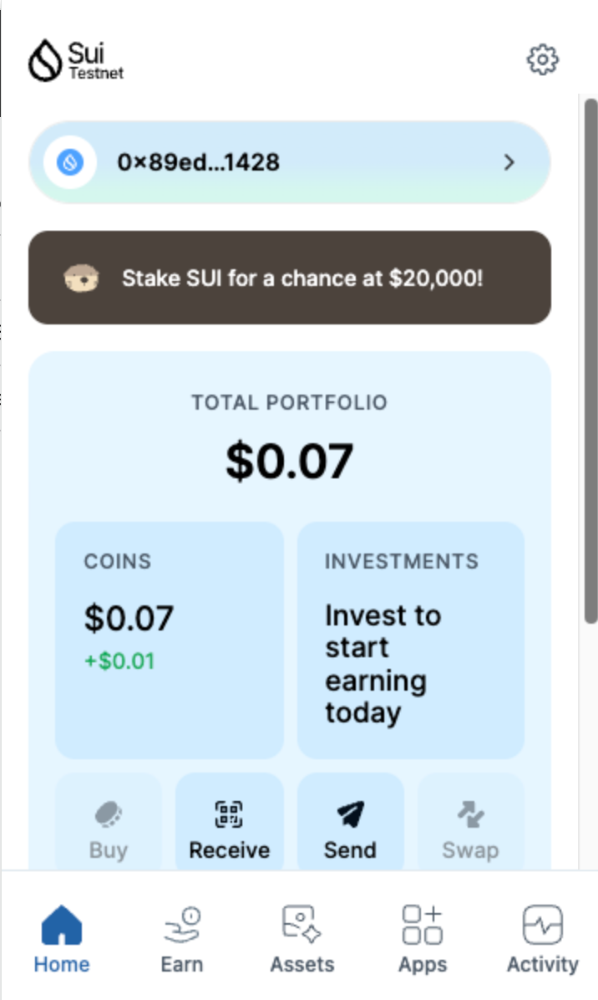
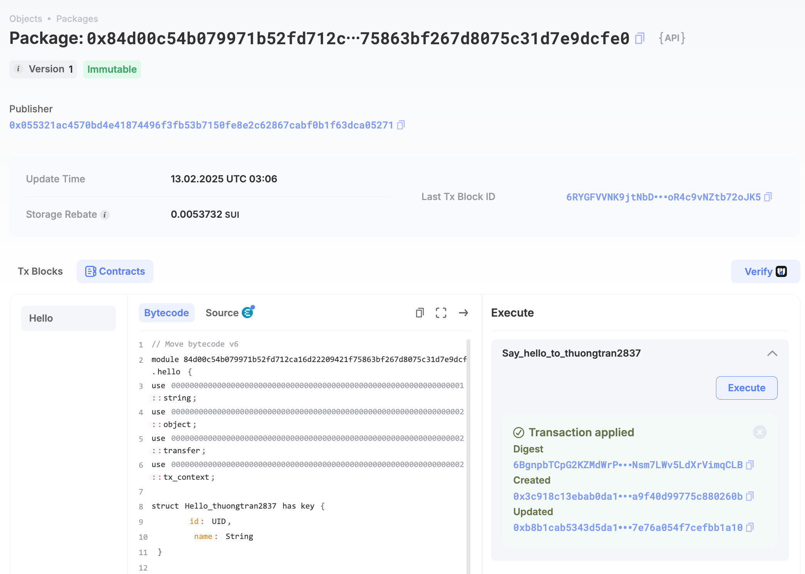
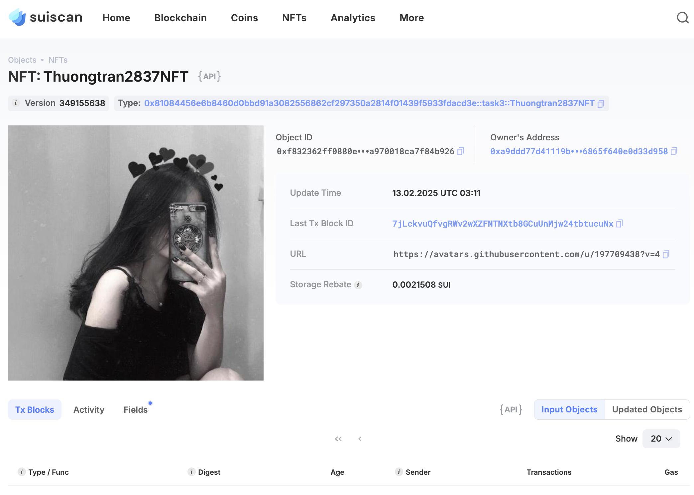

## Basic Information
- Sui Wallet Address: `0x89edc893a5637f77d5a1d621001ecca863245f1cb66f7ff0676c7507241a1428`
> First-time participants must complte the registration of the wallet address through the first task to have it merged. You should use this address for subsequent tasks. We will also use this address to credit the learning rewards.
- Github: `thuongtran2837`

## Personal Introduction
- Work Experience: `3 years`
- Tech Stack: `C#`, `Unity`, `Move`
> Gaming has always been my passion, and now I am thrilled to explore how blockchain technology can revolutionize the industry. By learning Move, I aim to create games that offer players true ownership of their in-game assets while leveraging Sui’s capabilities for fast and secure transactions. I believe that the future of gaming lies in decentralization, and I’m excited to be part of this transformation. Let’s build immersive experiences that push the limits of creativity!
- Discord: `conganbui_83455`

## Tasks

### 01 hello move
- [x] Sui CLI Version: sui 1.42.0
- [x] Sui Wallet Screenshot: 
- [x] Package ID:0x84d00c54b079971b52fd712ca16d22209421f75863bf267d8075c31d7e9dcfe0
- [x] Package ID's Screenshot from Explorer: 

### 02 move coin
- [x] `My Coin` Package ID:0x2a156219ee9d174616ca869d39a90ad0bf76c037d8d432fc85e09c68dc6d138a
- [x] `Faucet Coin` Package ID:0x012736c041b4a4c7c7ce6a6232fa27df72869d69bfd8004cc32c37363a87cf4a
- [x] Transfer `My Coin` hash:ABgTw523Ke7bmXSRSyNbqD1BJ1vemSjzKr5aoGXCqzGP
- [x] `Faucet Coin` address 1 mint hash:BrfCKnpMFhnNhzt5qV4dJGMmRvFswy2Rn5uFGq9tjKTT
- [x] `Faucet Coin` address 2 mint hash:FFT3dxXa9ts8oc3JNLBAkg8UFNWXA74ninoaTeHT6gh7

### 03 move nft
- [x] NFT Package ID:0x81084456e6b8460d0bbd91a3082556862cf297350a2814f01439f5933fdacd3e
- [x] NFT Object ID:0xf832362ff0880e3dbdad9ad61a403d591eed57a86cf8ad5a970018ca7f84b926
- [x] Transfer NFT hash:7jLckvuQfvgRWv2wXZFNTNXtb8GCuUnMjw24tbtucuNx
- [x] NFT's Screenshot from Explorer: 

### 04 move game
- [x] Game Package ID:0xf4b726a31c7f3da955a43f76f4faf36e6fd9a04746fcf93c5ae1121426ba01d3
- [x] Deposit Coin Hash:GejBW1Rih8ziwYMCzpSizf8eFLbhdpZqZ2DvAsWY48P2
- [x] Withdraw Coin Hash:3V7T7e8dXwPpxttQYvcXPvCu4dd1atz27AtwNqjcveZR
- [x] Play Game Hash:DKBPGSsLzP7cysSVWv9Zj3utgShi4PVCapBLZnjghyhA

### 05 move swap
- [x] Swap Package ID:0xb4ea4884bc9cc77fa61898ba5950d45c996896488ff272fd70d2d35f282ec75c
- [x] Call Swap Coin A -> Coin B hash:HiDzNNUjaX8MRQQbQF3brCdQ7FqTBry6CQSTah8dNjEn
- [x] Call Swap Coin B -> Coin A hash:E5Zw3mDGqvVCHwnbqoFcGZMBpBWMWjY1ZcigGBxWZKAp

### 06 dapp-kit SDK PTB
- [x] Save Hash:86UrGfV7byuLdsHbr3S9mwSLcMEsAhVTaWKaxaFoPqzn
