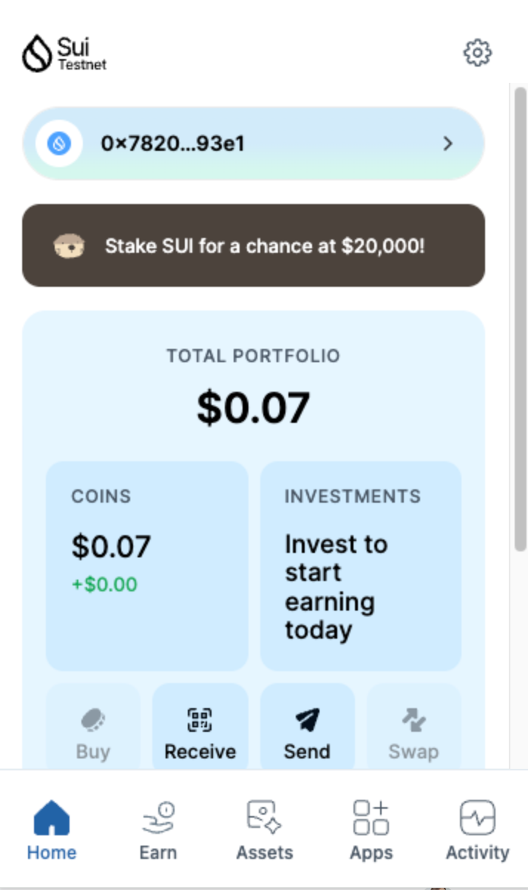
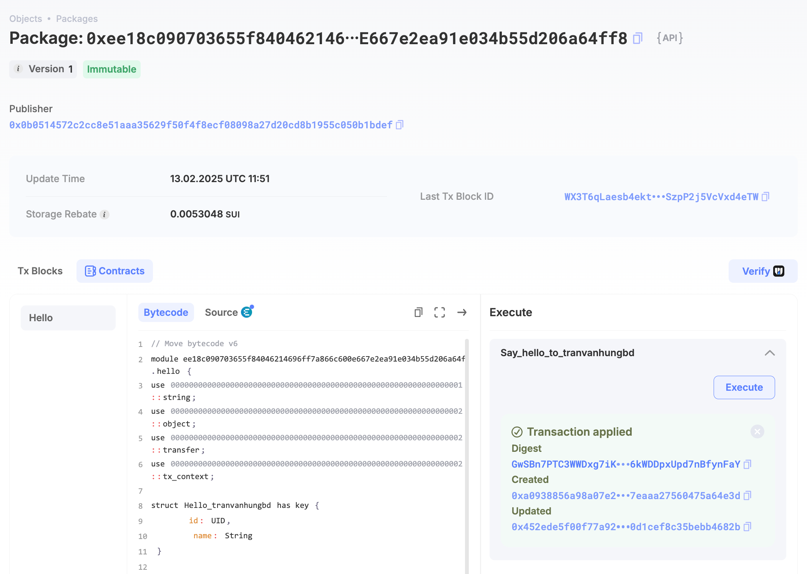
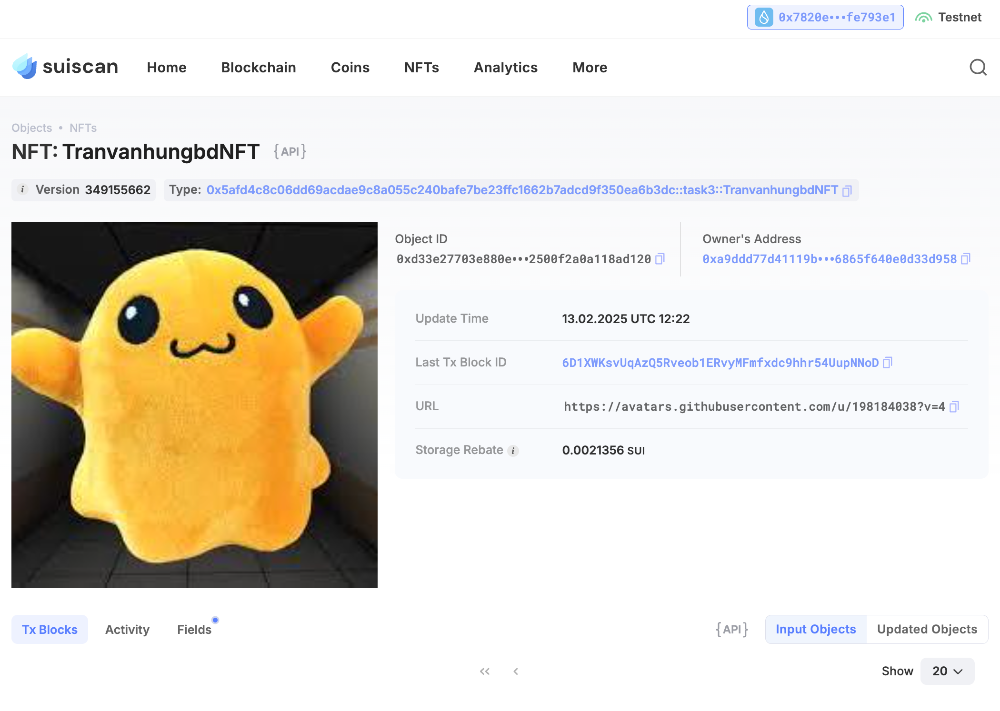

## Basic Information
- Sui Wallet Address: `0x7820ef79ae624deb1cb0c1adc8197fd132c91366e8c212e5e240f3198fe793e1`
> First-time participants must complete the registration of the wallet address through the first task to have it merged. You should use this address for subsequent tasks. We will also use this address to credit the learning rewards.
- Github: `tranvanhungbd`

## Personal Introduction
- Work Experience: 4 years
- Tech Stack: C++, Go, Move (learning)
> As a blockchain researcher, I’m passionate about understanding the theoretical foundations of decentralized technologies. Currently delving into Move’s unique resource model and exploring its applications on Sui. I believe that through research and experimentation, we can push the boundaries of what’s possible in the Web3 space. I’m excited to share my findings and collaborate with fellow enthusiasts to create innovative solutions!
- Discord: `Hùng Trần BD`
## Tasks

### 01 hello move
- [x] Sui CLI Version: sui 1.42.0
- [x] Sui Wallet Screenshot: 
- [x] Package ID:0xee18c090703655f84046214696ff7a866c600e667e2ea91e034b55d206a64ff8
- [x] Package ID's Screenshot from Explorer: 

### 02 move coin
- [x] `My Coin` Package ID:0x80ba2a672f745c77ccae3a5614d6832d376d923e3336baeafccad713df8cecae
- [x] `Faucet Coin` Package ID:0x348df1be8a7a40417b51b62827bb443518ab21c2ef6a63eb030db7312e63185c
- [x] Transfer `My Coin` hash:FQ9BzE441rGT7tqKBtJvKef92Zw6we7GhkYPfvsvYboi
- [x] `Faucet Coin` address 1 mint hash:3upCjhefkvkM84q3b4hkq8hwG664GWjXi7uKeGeijzQp
- [x] `Faucet Coin` address 2 mint hash:7x8HpLkL3i8iLaiWLowmwc3xnpjaXwkuynjiswB9iFP2

### 03 move nft
- [x] NFT Package ID:0x5afd4c8c06dd69acdae9c8a055c240bafe7be23ffc1662b7adcd9f350ea6b3dc
- [x] NFT Object ID:0xd33e27703e880e1bd80d73d05b2af52455470abb2cf6cb42500f2a0a118ad120
- [x] Transfer NFT hash:6D1XWKsvUqAzQ5Rveob1ERvyMFmfxdc9hhr54UupNNoD
- [x] NFT's Screenshot from Explorer: 

### 04 move game
- [x] Game Package ID:0xd6656dce7e0498836a48a55e90b82df2a7b8cb29eaaa17fad003bf974ef3f1ef
- [x] Deposit Coin Hash:7hKsXcwMpcFaiQJigd4y3BYDwW263mSqFsudHkMUEanb
- [x] Withdraw Coin Hash:EX6XujqAHrdzcCwkeD1w1E5rcosptkiFF2i4DAw1Usah
- [x] Play Game Hash:3Pu8WtgFgDYwiSx1qbZaVCqGNQkCeU8Fp3zz52bA2J2E

### 05 move swap
- [x] Swap Package ID:0x67c90cbfc3946ecbac8647a8fdd25872443cf9e5fa04e540e0e6046876365447
- [x] Call Swap Coin A -> Coin B hash:BnHaE72kkjwtPTMTBY1D2jNzPpp8GdWnAoNGQZqsyhHj
- [x] Call Swap Coin B -> Coin A hash:6WRUr11YY9YzcHGkkWYDzTBE2aQK3Mj9iGjCC2BbRBzN

### 06 dapp-kit SDK PTB
- [x] Save Hash:HH1ZjYTA5ytTkUCQ3xB3opf94z33u6YrHUP1prsCEwrt
